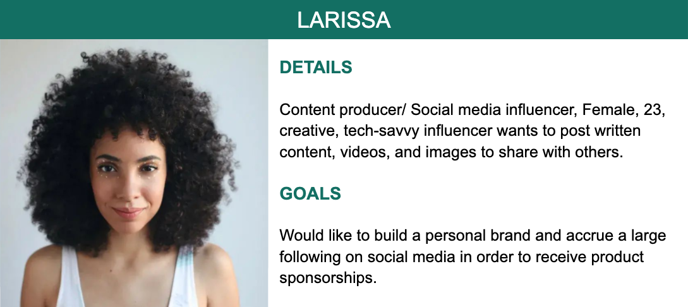

## T3A2-B - PostMelon Documentation (Frontend)

#### **By:** Patricia Pavia, Linda Ojinnaka & Vincent Lieu

---

#### Links:

###### Netlify Frontend: https://postmelon.netlify.app/

###### Frontend repo: https://github.com/vincentlieu/postmelon-frontend

###### Heroku Backend: https://postmelon.herokuapp.com/

###### Backend repo: https://github.com/vincentlieu/postmelon-backend

---

### Mission Statement

###### *“Give users the power to express themselves, build community, and stay connected with what’s going on in the world.” - PostMelon*

### Purpose

PostMelon provides users the power to express creative ideas and share information while staying connected to friends and family around the world. Fundamentally, PostMelon is a social media application, similar to Facebook, in the regard that is also gives users the power to:

- Connect with family and friends online.
- Express themselves through creative ideas and shared content on profile posts.
- Discover content from friends and family.
- Meet people with common interests.

### Functionality/Features
- **Registration**
  A valid registration is mandatory for all users of the application. Upon arrival of the index landing page, a registration/login prompt is rendered to the visitor, and cannot be bypassed unless the visitor either logs in with their username and password or registers a new account.
- **Login**
  Login credentials include the email and password created by the user during registration. After selecting “login” from the registration/login prompt, the user will be able to enter their credentials in order to be redirected to their home feed.
- **Home feed**
  The home feed is a feature in which the user is able to view recent posts from friends on their friends list, in descending order of date and time. The user’s home feed is only available to the user and is also used to share and express content.
- **Profile:**
  The profile is a page that contains general information about the user and a "wall” directly below containing the users’ written posts, media/images, and shared content created in their home feed.
- **Posts:** 
  Key feature of the PostMelon application. Within each post, a user has the power to upload text, images, or videos. CRUD operations can also be performed on all aforementioned mediums. A user will be able to:
  * Create a post.
  * Read their post and friends’ posts.
  * Edit their own posts.
  * Delete their own post.
- **Comments:** 
  Under each post, there is a comment button, that when clicked, displays a text box that allows friends to add text or media. Uploaded comments can be in the form of text, media, and images. When a user clicks submit, their comment is appended to the original post and displayed.
- **Liking posts:** 
  Likes are another key feature of engagement that allows users to interact and express interest in a post. The like button is a counter, displayed on the same level as the comment button that updates with each click. A visible number is incremented with each click of the “like” button.
- **Sharing posts:** 
  The share button is another fun feature of engagement, similar to the comment and like feature, but has an additional unique purpose. In PostMelon, users are only able to view another user’s profile if they are on their friend's list. However, a user is able to share posts or media displayed on friends’ wall to their own, thus displaying that content to their own group of friends. This creates a way for users who have mutual friends to connect with one another over shared interests, therefore expanding their friend's list and the communities within the application.
- **Friends List:** 
  The friend's list is a list of users a profile owner has added. A friends list displays the full name and profile picture of each user. Friends within a friends list are allowed access to all content displayed by the owner of the profile.
- **User management:** 
  Users are given several options when managing account. Users have the power to update their profile picture, bio, date of birth and name.
- **Help Section/Documentation:** 
  The Help page contains documentation users can access to learn more about the application, it's functionality, and its features. On this page, there will be an accordion for each of the sections below and will display the following information when clicked:
  * **About:** Mission statement, facts, and goals of the application.
  * **Features:** All of the apps’ features along with written How To’s and helpful tips on maximising feature functionality.
  * **FAQ:** Approximately 5-10 anticipated questions/answers.
  * **Contact:** A catch-all for any questions that have not been answered.

### Target audience

1. People that would like to stay connected with friends and family.
2. People that would like to connect with other users who share  common interests.

PostMelon is an inclusive social media application that welcomes all ethnicities, genders, and backgrounds in order to create a diverse, worldwide community. Simply put, PostMelon’s target audience is anyone who would to connect and socialise with others online.

### Technology stack

#### Frontend:

* React​
* Material UI
* Netlify

#### Backend:

* MongoDB​
* Amazon S3​
* Heroku​
* Node.js
  * Express.js
  * JSON webtoken
  * Mongoose
  * Bcrypt.js
  * Express Validator 
* Github​
* Git

#### Business Tools:

* Slack
* Atlassian JIRA

---

### Dataflow Diagram

#### Level 0: Context Diagram

Depicted below is the context diagram indicating the interaction between the external entity 'user' and PostMelon. This provides a high-level overview of how the user interacts with the system and what data might be passed between the system and external entity.

#### Level 1: Data Flow Diagram

The Level 1 Data Flow Diagram indicates a further breakdown of the context diagram, providing a more detailed view of what data is passed between the external entity - user and the PostMelon system. As indicated below; in order to perform a process the user will provide data input for the given process and during processing will interact with the data storage and provide an output back to that given process. 

---

### Application Architecture Diagram

Below is the application architecture diagram that provides a high level system overview of PostMelon. Depicted below shows four tiers - Client, Presentation, Business Logic and Data. 

The client tier resides outside the application (indicated by the dotted box to represent the entire application) where the user would interact with the system through either a desktop or mobile browser. 

PostMelon is a full stack application built using the MERN stack utilising a three tier architecture built entirely on JavaScript and JSON. Within each tier the main technologies that will be used to build the application. The frontend will be hosted on Netlify where React.JS will be heavily utilised to allow the user to interact with the application. To interface between frontend and the backend; Axios will be used to send HTTP requests and responses. The Node.js web server will be hosted on Heroku which houses express.js framework and mongoose.js as the ORM. All data will be stored in MongoDB which is hosted on MongoDB Atlas. 

---

### User Personas

### User stories

A pdf export of all user stories can be found [here](docs/user-stories-personas/user-stories-export.pdf).

| **Summary**              | **Issue key** | **Description**                                              |
| ------------------------ | ------------- | ------------------------------------------------------------ |
| **Homefeed**             | POS-23        | *AS* a user,  *I WANT TO* see new posts from people on my homefeed in real-time,  *SO THAT I* can see what my friends are up to and stay updated on events I may have missed such as wedding proposals, fantasy football league drafts, etc.     *ACCEPTANCE CRITERIA:*    * The user should be able to create a new post from the home page.  * Homefeed should be sorted descending by created date and time.  * The home page should only display posts from the user and their friends.  * Each post should be timestamped by created date. |
| **Comments**             | POS-27        | *AS* a registered user,  *I WANT TO* be able to comment on my friends’ posts,  *SO THAT* I can engage with activities online I may have missed in person.     *ACCEPTANCE CRITERIA*    * There must be a comment button under each users’ post.  * The comment button should only be viewed by friends of the user who has posted.  * Text validation should be injected to ensure users do not post empty comments.  * When the user hits the submit button, the comment should be added directly under the post.  * The creator of the post should be able to see all of the comments under their post.  * After the user posts a comment; the date and time of the comment should be displayed next to the post.  * After the user posts a comment; they should be able to edit a comment they have posted. * After the user posts a comment; they should be able to delete a comment they have posted.  * A delete button should be added next to the comment under the post- only the author of the comment should have access to this.  * An edit button should be added next to the comment under the post - only the author of the comment has should have access to this. |
| **Manage friends**       | POS-29        | *AS* a registered user,  *I WANT TO* view and manage my friend's list,  *SO THAT* I can view all my friends.     *ACCEPTANCE CRITERIA*    * Viewing friends should be accessible through my profile and clicking on the friends counter hyperlink that invokes a pop up window with all the user’s friends.  * On the pop up window, each friend should have; a small image of their profile photo and their name.  * To remove a friend; the user should click on the remove friend button which should display a confirmation window. When confirmed, the friend should be removed from the friends list and the friend’s counter should be reduced.  * To add a friend; the user should navigate to the public profile and click on the add friend button which should display a confirmation window. When confirmed, the friend should be added from the friends list and the friend’s counter should be increase. |
| **Profile View**         | POS-30        | *AS* a registered user,  *I WANT TO* have all the content I have posted my profile page,  *SO THAT* my friends and I can view all the posts I have made to date.     *ACCEPTANCE CRITERIA*    * There needs to be a profile page where all user’s posts are displayed  * All posts should; be in descending order by created date so the user’s friends can determine the newest posts.  * The profile page should have user banner that contains the user’s full name, picture, biography, joined date(account created date), amount of friends, posts and likes.  * *MY PROFILE -* If the current user matches the profile being viewed then display the edit button to allow the user to edit their profile.  * *PUBLIC PROFILE -* If the current user visits a profile page where the profile is *not* in the current user’s friend list, then display an add friend button to allow the current user to send a friend request. * *FRIEND’S PROFILE* - If the current user visits a profile page where the profile is *in* the current user’s friend list, then display a remove friend button to allow the current user to remove the friend. |
| **Posts**                | POS-31        | *AS* a registered user,  *I WANT TO* be able to create, edit, and delete posts,  *SO THAT* I can have control over the content that I provide.     *ACCEPTANCE CRITERIA*    * All posts should have a profile picture along with the body of the post and the timestamp of which the post was created.  * The user should be able to create a new post through the create post section located at the top of the homefeed.  * When the user clicks ‘Create post'; the homefeed should be displayed at the top of the homefeed.  * There should be an edit button directly under each user’s post.  * The edit button should be made available only to the author of each post.  * When the edit button is clicked; the content should be available to edit.  * When the edit button is clicked; A “save changes” button should appear at the bottom of the post.  * When the save changes button is clicked; the user should see an updated version of what they edited.  * The delete button should be under each post.  * When the delete button is pressed; the user should be redirected to their home page. |
| **Login**                | POS-39        | *AS* a registered user,  *I WANT TO* be able to login using my email,  *SO THAT* I don't have to remember a username.     *ACCEPTANCE CRITERIA*    * Successful authentication with valid email and password combination.  * Invalid email and password combination should return validation indicating invalid credentials. |
| **Registration**         | POS-40        | *AS* a potential user,  *I WANT* to be able to register for an account,  *SO THAT* I can share my posts with my family and friends.     *ACCEPTANCE CRITERIA*   * Accessible from the navigation bar.  * Accessible from the login form.  * Contains required fields - Full name, email, password, and password confirmation.  * Password has minimum criteria of 6 characters.  * Password value should match for both the password and password confirmation field.  * Login is accessible from the registration form. |
| **Navigation bar**       | POS-51        | *AS A* registered user,  *I WANT* to be able to navigate PostMelon easily,  *SO THAT* I can quickly navigate the site.     *ACCEPTANCE CRITERIA*  * Navigation bar should be visible across all pages of PostMelon  * Search input field - Display the list of users that match the input value. Clicking on the user will navigate to the user's profile.  * Logo - Navigates user to homefeed  * Home Icon - Navigates user to homefeed  * Cog Icon - Navigates to edit user profile  * Question Icon - Navigates to help  * My Profile - Navigates to the user profile  * Sign Out - Signs out of the user account |
| **Liking Posts**         | POS-26        | *AS* a registered user,  *I WANT TO* be able to like posts,  *SO THAT* I can show interest in a post that was created.     *ACCEPTANCE CRITERIA*    * There should be a like button accessible for each post. This will be displayed beneath the counters (like & comments) of the post.  * Toggling the like button will increment or decrease the like counter for the post.  * The like counter should be visible beneath the body of the post. |
| **Help Center**          | POS-32        | *AS* a user, *I WANT* a help page,  *SO THAT* I can be able to view the applications' features and read site documentation if I am unclear on how to use a specific feature.     *ACCEPTANCE CRITERIA*    * A help center page should be accessible through the navigation bar by clicking on the help button.  * The help center page should an accordion with the sections - About Us, FAQs, Features and Contact Us.  * “FAQ” should expand into a list of questions and answers.  * “Features” should expand into a list of features and their descriptions.  * “Contact Us” should expand and display details on how to contact PostMelon.  * “About Us” should expand and display details about PostMelon. |
| **Profile Photo**        | POS-34        | *AS* a registered user,  *I WANT TO* frequently change my profile photo,  *SO THAT* I can keep followers updated on my newest looks.     *ACCEPTANCE CRITERIA*    * The user should be able to attach a profile picture through the edit profile page.  * When the user clicks choose photo, they should be able to choose an image file from their computer and upload it to PostMelon.  * When the user clicks confirm changes; The user’s profile picture should be updated. |
| **Delete Account**       | POS-35        | *AS* a user,  *I WANT TO* be able to delete my account,  *SO THAT* I can leave the PostMelon community.     *ACCEPTANCE CRITERIA*    * The delete account functionality should be accessible through the edit profile page.  * When the delete account button is clicked, a prompt that says, “Are you sure you would like to delete your account? All posts, friends, and messages will be deleted.” will appear.  * When the prompt appears, two options should be displayed directly underneath the message -”Yes, I am sure” and “No, I am not sure.”  * When the user clicks, “Yes I am sure,” the user will be navigated to the landing page. |
| **Media Uploads**        | POS-37        | *AS* a user,  *I WANT TO* be able to upload images or videos to a post,  *SO THAT* I can spread the media content with my friends.     *ACCEPTANCE CRITERIA*    * Upload image/video button should be available when creating post. When clicked, the user should be prompted to upload a media file to be attached.  * When create post is clicked, the media file should be visible on the body of the post.  * Image format allowed - .png, .jpeg, .jpg, .bmp * Video format allowed - .avi, .mp4, .mkv  * If the file is invalid then display an error message indicating to the user that it is an invalid file format. |
| **Share Post**           | POS-38        | *AS* a registered user,  *I WANT TO* be able to share posts of ducko content I find on other friend’s pages.  *SO THAT* I can show all my friends the best up to date ducko news and connect friends.    *ACCEPTANCE CRITERIA*    * A “share” button should be displayed under each post.  * When the user clicks the share post button; a share post pop up should be appear and the post to share should be displayed.  * The user should be able to add text to the post shared.  * When the user wants to submit the shared post, a “share” button at the bottom of the pop up can be clicked.  * When the share button is clicked; the user is redirected to the home page with the shared post as the latest post on the home feed. |
| **404 - Page not found** | POS-52        | *AS A* user,  *I WANT* to be redirected to a 404 page when a route is invalid,  *SO THAT* I am provided information regarding to why the page is not available.    *ACCEPTANCE CRITERIA*  * The page should display an error message indicating that the page is not found  * All invalid routes should be redirected to this page.  * The page should have a user-friendly message regarding the error. |

---

### Wireframes

A pdf export of all wireframes can be found [here](docs/wireframes/wireframes-all.pdf).

---

### Project management - Atlassian's JIRA

#### Board setup

1. Each user story is housed under either R1 - MVP or R1 - Options. This is to ensure that each user story is categorised accordingly to whether they are an MVP item or an additional feature to be implemented if time permits.
2. Each user story created is assigned a priority to indicate which items are critical for the functionality of the application, where they will then be auto sorted based on priority in the Kanban board. 
3. Max capacity is set on the Kanban board is configured to ensure that the story being worked on is done to its fullest before picking up a new task. *This is indicated by 'MAX' on the columns.*
4. In Review column is created to ensure that another member looks over the work that has been completed. In this column - suggestions and feedback can be provided to the ticket owner. Once the review has been completed; the original user can move it into the done column.
5. Days in column is enabled to indicate the amount of days a ticket has been sitting in a column. Tickets that have been sitting in a column for a longer period of time reflects that the item should be picked up. *This is indicated by the dots next to the priority of the ticket.*
6. Integration with Github is enabled to allow each branch and commits to be tracked accordingly to the user story on the Kanban board, allowing traceability to which acceptance criteria was being worked on for that particular story.
7. Reference links are provided on the sidebar for quick accessibility to resources. Some notable resources provided are:
   - Github documentation repository
   - Github frontend repository
   - Github backend repository
   - Heroku backend server 

#### Tracking - Tasks

Below is an insight of each task is tracked. The parent ticket (task) is broken down into smaller subtasks and tracked. As displayed below; for the given ticket; it is at 50% completion; with one ticket POS-43 in review by another team member. Once all subtasks are completed (done); the parent ticket will also be transition to the done status.

#### Tracking - Development

Below is an insight to how development will be tracked. By integrating PostMelon's GitHub repository with JIRA, all commits associated with ticket can be traced; as indicated in the development section below there were five commits performed to the postmelon-backend repository that are associated with the ticket. The use of the checklist functionality for the tickets allows the team to track the progress of the ticket; as seen below backend logic has been completed.

#### Board screenshots

##### Day One - Initial planning

##### Day Two - Documentation progression

##### Day Three - Documentation progression

##### **Day Four - End of documentation**

